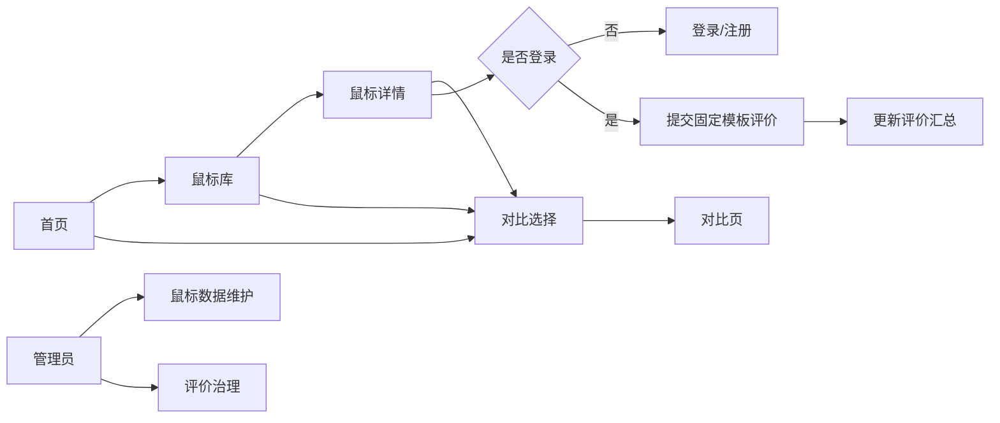
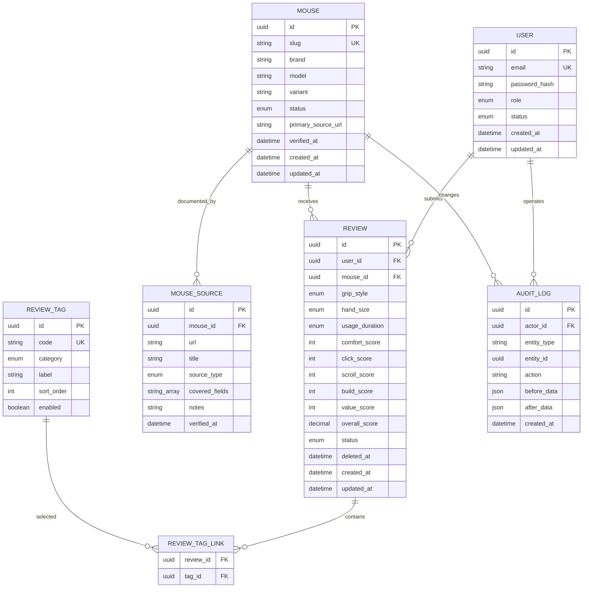

# 鼠标参数与主观评价网站开发文档

> 文档版本：v1.0
> 更新日期：2026-07-26
> 项目阶段：功能型 MVP 已完成，进入数据质量与上线验收阶段
> 参考产品：[EloShapes](https://www.eloshapes.com/)

## 1. 文档目的

本文档用于统一产品、设计、前端、后端、测试和数据维护人员对 MVP 的理解，并作为开发排期、接口联调与验收的依据。

当前仓库已经包含 Spring Boot API、Vue 单页应用、Flyway 迁移、自动化测试和生产配置。本文件同时记录现行实现口径与后续验收要求；若“候选方案”与代码冲突，以本文标注的现行口径和接口测试为准。

## 2. 项目概述

### 2.1 产品定位

建设一个面向鼠标用户的参数查询与横向对比网站。用户可以：

1. 浏览、搜索和筛选鼠标；
2. 查看单款鼠标的完整客观参数；
3. 同时选择多款鼠标，对齐查看参数差异；
4. 登录后按固定评价模板提交主观使用评价；
5. 查看评价均分、分布、标签和样本量。

产品的信息架构参考 EloShapes 的“Browse + Compare”模式，但 MVP 不实现鼠标轮廓图、外形叠加和 3D 建模。

### 2.2 产品目标

- 让访客能在 3 次以内的主要操作中找到目标鼠标或进入对比页；
- 让不同品牌、单位和字段命名下的鼠标参数具有统一口径；
- 用结构化、不可自由输入的评价模板沉淀可聚合的主观数据；
- 为后续扩展轮廓图、推荐算法、价格信息和更多外设品类保留清晰边界。

### 2.3 非目标

MVP 明确不包含：

- 鼠标轮廓图、尺寸图叠加和 3D 模型；
- 鼠标垫、传感器、微动、编码器等独立品类库；
- 电商下单、价格追踪、优惠码和联盟营销；
- 用户自由文本、图片或视频评价；
- 私信、关注、评论回复等社区功能；
- 基于手型或历史行为的个性化推荐；
- 自动抓取第三方网站数据。

### 2.4 MVP 范围冻结

| 首版必须交付 | 首版明确不交付 | 上线后候选 |
| --- | --- | --- |
| 鼠标库、详情、筛选、2～4 款对比、固定评价、逐条公开评价、评分排行、精确/相近推荐及解释、产品图片、邮箱登录与忘记密码、CSV 导入、举报/纠错闭环和运营管理后台 | 鼠标轮廓/轮廓叠加/3D 鼠标模型、自由文本、商品价格、其他外设品类 | 持有验证、第三方登录、收藏和订阅 |

下架鼠标的公开详情页统一返回 `404`，且不进入搜索、对比和评价汇总。隐私政策、用户协议和评价规则属于上线必备静态页面，不需要独立业务 API。

## 3. 用户角色与权限

| 角色 | 能力 |
| --- | --- |
| 访客 | 浏览、搜索、筛选、查看详情、选择并分享对比、查看评价汇总和逐条公开评价 |
| 注册用户 | 访客全部能力；提交、修改和删除自己的固定模板评价；举报评价和提交鼠标数据纠错 |
| 管理员 | 用户全部能力；新增/编辑/下架鼠标、批量导入数据、调整用户角色、封禁/解封用户、查看并治理评价、查看审计记录 |

默认采用登录后评价。MVP 不开放匿名评价，以降低重复提交、刷分和内容治理成本。

## 4. 核心业务规则

### 4.1 鼠标数据

- 每个“品牌 + 型号 + 版本”对应一条鼠标记录；不同尺寸或硬件版本应拆分记录。
- 所有物理尺寸统一存储为毫米（mm），重量统一存储为克（g）。
- DPI、回报率、追踪速度和加速度分别使用 DPI、Hz、IPS、G。
- 未确认的数据存为 `null`，前端显示“暂无数据”，不能用 `0` 代替未知值。
- 数据记录需要保存来源链接、最近核验时间和发布状态。
- 下架仅影响公开展示，不物理删除已被评价或引用的数据。
- 鼠标状态流转为 `draft → published ↔ archived`；只有 `published` 对公开接口可见。发布时必须通过全部发布级字段校验。

### 4.2 对比

- 单次至少选择 2 款、最多选择 4 款鼠标。
- 第一款鼠标为默认基准项；用户可以调整顺序。
- 数值字段展示原始值；非基准项同时展示相对基准项的差值百分比，公式为 `(当前值 - 基准值) / abs(基准值) × 100%`，四舍五入保留 1 位。正号仅表示数值更大，不代表更好。
- 枚举或布尔字段仅标记“相同/不同”，不推导优劣。
- 基准值为 `0`、任一侧缺失或字段不可做数值比较时，差值显示“—”。
- 对比选择写入 URL，例如 `/compare?ids=id1,id2,id3`，便于刷新恢复和分享。
- URL ID 先按出现顺序去重，再截取前 4 个；接口只返回其中状态为 `published` 的记录并保持请求顺序，不用后续 ID 补位。无效、草稿或下架 ID 对外均按不存在处理；不足 2 款时回到选择状态并提示原因。
- API 收到超过 4 个去重 ID 时返回 `400 TOO_MANY_COMPARE_ITEMS`；正常响应中的鼠标顺序必须与请求顺序一致。
- “仅显示差异”按规范化原始值判断：数值按数据库精确值比较，文本/枚举区分大小写并按 code 比较，日期按 ISO 日期比较，布尔值直接比较，数组去重排序后按集合比较；所有项均为 `null` 的行视为相同。
- 主观评分在对比中显示均分、样本数和低样本标记；只展示与基准的绝对分差（例如 `+0.4 分`），不计算百分比。

### 4.3 主观评价

- 评价内容完全结构化，MVP 不提供自由文本输入框。
- 同一用户对同一款鼠标只能保留一份有效评价，可重复编辑。
- 只有状态为 `published` 的鼠标可以新增评价。
- 所有评分均为 1～10 的整数，1 表示很差，10 表示很好。
- 公开评分只统计握姿舒适度，按当前握姿与手长筛选后保留 1 位小数；客户端不得自行提交汇总分。
- 公开页面只展示聚合结果和当前登录用户自己的评价，不展示其他用户的逐条评价；管理员可按治理需要查看单条记录。
- 汇总数据必须显示有效样本数；样本数少于 5 时显示“样本较少”，且不参与站内榜单排序。
- 删除评价采用软删除，评价不再计入汇总，但保留审计信息。
- 有效评价的唯一判定式为 `status = active AND deleted_at IS NULL`。`status` 仅使用 `active/disabled`，其中 `disabled` 表示管理员停用；`deleted_at` 仅表示用户删除。
- 用户在已发布鼠标上再次 `PUT` 自己已删除的 `active` 评价时，系统清空 `deleted_at` 并恢复该记录；用户不能通过 `PUT` 恢复管理员停用的评价。
- 鼠标下架后，用户不能新增或编辑评价，但仍可删除自己的评价；管理员恢复评价不会清除用户的 `deleted_at`。

## 5. MVP 功能需求

### 5.1 首页 `/`

首页以快速进入核心任务为目标，包含：

- 产品标题和简短说明；
- 全局鼠标搜索框只按型号关键词进行忽略大小写的部分匹配；提交后跳转鼠标库并自动应用同一型号条件；
- “浏览全部鼠标”和“开始对比”入口；
- 最近新增或热门鼠标列表，可作为次要模块；
- 登录入口和当前对比数量提示。

### 5.2 鼠标库 `/mice`

#### 列表信息

每张卡片或表格行至少显示：

- 品牌、型号、版本；
- 尺寸分类；
- 长 × 宽 × 高；
- 重量；
- 外形类型；
- 连接方式；
- 传感器；
- 最大 DPI；
- 最大回报率；
- 握姿舒适度均分和样本数；
- “加入对比”操作。

#### 搜索、筛选与排序

| 类型 | MVP 项目 |
| --- | --- |
| 搜索 | 仅型号，忽略大小写，支持部分匹配 |
| 品牌 | 多选 |
| 尺寸分类 | 超小/小/中/大，多选 |
| 重量 | 最小值和最大值 |
| 外形类型 | 对称/人体工学/混合，多选 |
| 连接模式 | 有线、2.4G、Bluetooth，多选；命中任一所选模式 |
| 传感器 | 多选或关键词搜索 |
| 最大 DPI | 最小值 |
| 最大回报率 | 1000/2000/4000/8000 Hz 等，多选 |
| 排序 | 最近新增、品牌、重量升序/降序、评分、评价数 |

筛选条件同步到 URL 查询参数。桌面端使用侧栏或横向筛选条，移动端使用抽屉。清空筛选需要一次完成。

同一筛选类别内的多选使用 OR，不同筛选类别之间使用 AND。按评分排序时，样本数不少于 5 的鼠标按评分排序在前；低样本和无评价项目统一排在后方，再按评价数和 ID 稳定排序。

#### 分页

- 默认每页 24 条；
- 后端分页，禁止一次返回全量记录；
- 页码、总条数和当前筛选条件始终可见；
- 排序字段必须有稳定的二级排序，例如 `created_at DESC, id DESC`。

### 5.3 鼠标详情 `/mice/[id]`

页面分为四个区域：

1. 基础信息：品牌、型号、版本、发布时间、状态；
2. 参数分组：尺寸与重量、外形、传感器与性能、按键与滚轮、连接与其他；
3. 主观评价汇总：各维度均分、评分分布、常见优点/问题标签、样本数；
4. 当前用户评价：未登录时显示登录提示，已登录时显示新增或编辑表单。

详情页提供“加入对比”按钮。若已经加入，则显示“已加入”和移除入口。

### 5.4 对比选择

对比选择状态由全局前端状态维护，并同步到 `localStorage`：

- 用户可从列表页和详情页加入；
- 页面固定区域显示已选数量；
- 达到 4 款后继续添加时阻止操作并提示先移除；
- 用户可在进入对比页前删除、清空或拖动排序；
- URL 中的 `ids` 优先于本地状态，并在解析成功后覆盖本地状态。

### 5.5 对比页 `/compare`

采用“参数名为行、鼠标为列”的横向表格：

- 左侧参数列在桌面端固定；
- 移动端允许横向滚动，并固定当前参数列；
- 顶部固定每款鼠标的名称、核心参数和移除按钮；
- 参数按类别折叠/展开；
- 可切换“显示全部参数”和“仅显示差异”；
- 数值相对差异仅作事实展示，不使用“更好/更差”措辞；
- 主观评价作为独立分组展示均分和样本量；
- 提供复制链接按钮。

参数分组详见第 6 节。

### 5.6 评价表单

#### 评价上下文

| 字段 | 类型 | 固定选项 |
| --- | --- | --- |
| 握持方式 | 每种握姿独立评分 | 趴握、抓握、指握、混合 |
| 手长 | 从用户资料读取 | 小于 17 cm、17 cm（含）～19 cm（不含）、19 cm 及以上 |

#### 固定评分维度

| 字段 | 说明 |
| --- | --- |
| 握持舒适度 | 长时间握持和发力是否舒适 |

#### 支撑位置

用户可以在手掌模型上涂抹鼠标实际支撑区域。支撑位置与握姿舒适度独立保存，公开页面只展示匿名聚合热力图。

提交评分前必须完成手长和习惯握姿资料；每种握姿只能提交一份舒适度评分，删除后可重新提交。

### 5.7 账号

当前提供邮箱验证码 + 密码注册、邮箱 + 密码登录以及未登录忘记密码：

- 邮箱唯一；
- 密码最少 8 位；
- 密码使用 Argon2id 或 bcrypt 哈希，禁止明文存储；
- 登录失败使用统一提示，避免泄露邮箱是否存在；
- 支持退出登录；
- 注册和修改密码必须验证 6 位邮箱验证码；验证码仅保存哈希，并限制有效期、重发间隔和尝试次数。
- 忘记密码接口对已注册和未注册邮箱返回相同文案，验证码仅对已存在账号发送，避免泄露账号是否存在。

### 5.8 管理后台 `/admin`

管理员功能包括：

- 鼠标数据列表、搜索、筛选、创建、编辑、发布、下架；
- CSV 批量导入与逐行错误报告；
- 查看参数来源链接和最近核验时间；
- 发布前检查关键参数和有效来源 URL；草稿允许不完整，发布操作由后端强制拦截；
- 查看资料不完整、核验超过 180 天等待处理数量；
- 按邮箱、状态和角色查询用户，调整 `USER/ADMIN` 角色并封禁或解封普通用户；
- 角色调整与封禁立即生效并记录原因；禁止修改自身角色、直接封禁管理员或降级最后一个正常管理员；
- 查看、停用和恢复用户评价；
- 查看操作审计、导入记录并管理鼠标产品图片。

MVP 可不做复杂权限系统，先使用 `user.role = admin` 控制后台访问。

## 6. 鼠标参数字典

### 6.1 基础信息

| 字段 | 类型 | 必填 | 说明 |
| --- | --- | --- | --- |
| `brand` | string | 是 | 品牌规范名称 |
| `model` | string | 是 | 型号 |
| `variant` | string | 否 | 尺寸、代次或版本 |
| `slug` | string | 是 | 稳定可读别名；详情寻址仍使用 UUID |
| `aliases` | string[] | 否 | 搜索别名 |
| `release_date` | date | 否 | 发布日期 |
| `status` | enum | 是 | draft/published/archived |
| `primary_source_url` | string | 是 | 主要参数来源，发布时必填 |
| `source_notes` | string | 否 | 测量口径、重量是否含线材等说明 |
| `verified_at` | datetime | 否 | 最近核验时间 |

### 6.2 尺寸与重量

| 字段 | 类型/单位 |
| --- | --- |
| `size_category` | extra_small/small/medium/large |
| `form_factor` | full_size/fingertip |
| `length_mm` | decimal(6,2) |
| `width_mm` | decimal(6,2) |
| `height_mm` | decimal(6,2) |
| `weight_g` | decimal(6,2)，默认不含线材 |

### 6.3 外形

| 字段 | 类型/选项 |
| --- | --- |
| `shape_type` | symmetrical/ergonomic/hybrid |
| `hand_compatibility` | left/right/ambidextrous |
| `hump_position` | front/center/back/minimal/unknown |
| `thumb_rest` | boolean/null |
| `ring_finger_rest` | boolean/null |

### 6.4 传感器与性能

| 字段 | 类型/单位 |
| --- | --- |
| `sensor_name` | string |
| `sensor_type` | optical/laser/other |
| `max_dpi` | integer |
| `max_polling_rate_hz` | integer |
| `tracking_speed_ips` | integer/null |
| `acceleration_g` | decimal/null |

### 6.5 按键与滚轮

| 字段 | 类型/说明 |
| --- | --- |
| `button_count` | integer |
| `side_button_count` | integer |
| `switch_name` | string/null |
| `switch_type` | mechanical/optical/magnetic/other/null |
| `switch_lifespan_million` | integer/null |
| `hot_swappable` | boolean/null |
| `encoder_name` | string/null |
| `encoder_type` | mechanical/optical/other/null |

### 6.6 连接与其他

| 字段 | 类型/说明 |
| --- | --- |
| `connection_modes` | 非空枚举数组：wired/wireless_2_4g/bluetooth |
| `battery_life_hours` | decimal/null |
| `charging_port` | usb_c/micro_usb/proprietary/none/null |
| `material` | plastic/magnesium/carbon_fiber/composite/other/null |
| `onboard_memory` | boolean/null |
| `software_support` | boolean/null |

前端显示的“有线/无线/双模/三模”为 `connection_modes` 推导结果，不单独持久化。例如 `[wired, wireless_2_4g, bluetooth]` 显示为“三模”。

### 6.7 字段约束通则

- 草稿阶段只强制品牌、型号和 slug。发布至少要求：品牌、型号、slug、主要来源、长宽高、重量、尺寸分类、外形类型、连接模式、传感器名称、最大 DPI、最大回报率；不满足时发布接口返回字段级错误。
- 第 6.2～6.6 节字段除 `connection_modes` 外默认允许 `null`；数组默认空数组，布尔未知值为 `null`。
- 尺寸、重量、电池时长、DPI、回报率、追踪速度、加速度和按键数量若填写，必须大于 0；侧键数量可以为 0。
- `length_mm/width_mm/height_mm/weight_g` 最大值暂定 999.99，DPI 和 Hz 最大值暂定 1,000,000；超出时需要管理员人工确认并调整约束。
- Decimal 在 API 中统一序列化为 JSON number；日期时间统一使用 UTC ISO 8601 字符串，发布日期使用 `YYYY-MM-DD`。

### 6.8 参数来源

一款鼠标可以关联多条 `mouse_sources`：`id`、`mouse_id`、`url`、`title`、`source_type`、`covered_fields[]`、`notes`、`verified_at`。`source_type` 取 `manufacturer/manual/third_party`，`covered_fields` 保存本来源支持的字段 code。`primary_source_url` 用于列表快速展示，字段级溯源以 `mouse_sources` 为准。

## 7. 信息架构与关键流程



### 7.1 评价提交流程

1. 用户进入已发布鼠标的详情页；
2. 系统读取用户是否已有有效评价；
3. 用户选择握姿并提交舒适度评分；
4. 前端校验后提交；
5. 后端再次校验登录、鼠标状态、选项范围和标签数量；
6. 后端在事务中新增或更新评价；
7. 汇总数据失效并重新计算；
8. 返回最新个人评价与汇总结果。

## 8. 推荐技术方案

### 8.1 技术栈

| 层级 | 推荐方案 | 原因 |
| --- | --- | --- |
| 前端 | Vue 3 + Vite + Vue Router + Pinia | 独立前端工程，负责页面、路由与客户端状态 |
| 后端 | JDK 17 + Spring Boot 3 | 独立 REST API，符合既定 Java 技术环境 |
| 数据访问 | MyBatis-Plus | 提供类型化 Mapper、分页与条件构造器 |
| 表单/校验 | Vue 表单 + Jakarta Validation | 前端即时反馈，后端作为最终校验边界 |
| 数据库 | PostgreSQL 16+ | 适合筛选、聚合、约束和全文/模糊搜索 |
| 鉴权 | Spring Security + JWT Bearer Token | 适合前后端分离与无状态 API |
| 测试 | JUnit/MockMvc + Vitest + 浏览器端到端测试 | 分层覆盖业务规则、接口与用户流程 |
| 部署 | 前端静态托管 + Java 容器 + 托管 PostgreSQL | 前后端可以独立构建和发布 |

前后端分离部署；后端内部仍采用模块化单体，不在 MVP 阶段拆分微服务。评价汇总和搜索量增长后，再按真实瓶颈引入缓存或独立搜索服务。

### 8.2 推荐目录结构

```text
backend/
├─ src/main/java/.../
│  ├─ controller/
│  ├─ service/
│  ├─ mapper/
│  ├─ entity/
│  ├─ dto/
│  ├─ security/
│  └─ config/
└─ src/main/resources/
   ├─ application.yml
   └─ schema.sql
frontend/
├─ src/
│  ├─ views/
│  ├─ components/
│  ├─ stores/
│  ├─ router/
│  ├─ api/
│  └─ assets/
├─ package.json
└─ vite.config.js
```

约束：Vue 组件只能通过统一 API 客户端访问后端；Controller 不直接拼装 SQL；所有写操作经过 Service，MyBatis-Plus Mapper 只负责数据访问。

## 9. 数据模型

### 9.1 实体关系



上图重点表达实体关系，`MOUSE` 的完整参数列以第 6 节为准，并全部存放在 `mice` 主表；实现迁移时不得只按图中的摘要字段建表。

### 9.2 关键约束与索引

- `users.email` 唯一，并保存规范化小写值；
- `mice.slug` 唯一；
- 对规范化后的 `brand + model + variant` 建立唯一索引，其中空版本按空字符串处理，防止同一版本被重复录入；
- `reviews(user_id, mouse_id)` 建立唯一索引，软删除后仍通过更新原记录实现再次评价；
- 所有评分字段增加 `CHECK (score BETWEEN 1 AND 10)`；
- `overall_score` 由服务端计算，数据库可使用生成列或写入时校验；
- 标签关联使用 `(review_id, tag_id)` 联合主键；
- `mice(status, created_at, id)` 用于默认列表；
- `mice(brand)`、`mice(weight_g)`、`mice(shape_type)`、`mice(max_polling_rate_hz)` 建立筛选索引；
- 增加内部字段 `search_text`，由规范化的品牌、型号、版本和别名拼接生成；使用 PostgreSQL `pg_trgm` GIN 索引支持模糊搜索；
- 评价汇总查询使用 `reviews(mouse_id, status, deleted_at)` 索引。

### 9.3 核心枚举与状态迁移

| 领域 | 允许值 |
| --- | --- |
| 用户角色 | `user/admin` |
| 用户状态 | `active/disabled` |
| 鼠标状态 | `draft/published/archived` |
| 评价状态 | `active/disabled` |
| 握持方式 | `palm/claw/fingertip/mixed` |
| 手长 | `small/medium/large` |
| 使用时长 | `under_7_days/days_7_to_29/days_30_to_179/days_180_plus` |
| 标签类别 | `pro/con` |
| 来源类别 | `manufacturer/manual/third_party` |

评价状态迁移：

| 当前状态 | 操作 | 前置条件 | 结果 |
| --- | --- | --- | --- |
| 不存在 | 用户 PUT | 鼠标已发布 | 创建 `active`，`deleted_at = null` |
| active、未删除 | 用户 PUT | 鼠标已发布 | 更新原记录 |
| active、未删除 | 用户 DELETE | 本人操作 | 设置 `deleted_at = now` |
| active、已删除 | 用户 PUT | 鼠标已发布 | 更新并清空 `deleted_at` |
| 任意 deleted 状态 | 用户 DELETE | 本人操作 | 幂等返回 `204` |
| active | 管理员 disable | 管理员操作 | 改为 `disabled`，不改 `deleted_at` |
| disabled | 管理员 restore | 管理员操作 | 改为 `active`，不改 `deleted_at` |
| disabled | 用户 PUT | 无 | 返回 `409 REVIEW_DISABLED` |

只有 `active + deleted_at IS NULL` 进入公开汇总。鼠标非 `published` 时，用户 PUT 返回 `409 MOUSE_NOT_REVIEWABLE`，DELETE 仍可执行。

### 9.4 评价汇总

MVP 可实时聚合，并设置 1～5 分钟服务端缓存。响应至少包含：

```json
{
  "mouseId": "uuid",
  "sampleCount": 27,
  "overallAverage": 8.4,
  "dimensionAverages": {
    "comfort": 8.4
  },
  "scoreDistribution": { "1": 0, "2": 0, "3": 0, "4": 1, "5": 1, "6": 2, "7": 3, "8": 6, "9": 8, "10": 6 },
  "lowSample": false
}
```

`scoreDistribution` 统计当前握姿和手长筛选下 1～10 分的握姿舒适度数量。同一用户评价多个握姿时分别计入对应样本；全局汇总按用户资料中的习惯握姿加权，并在 API 响应阶段保留 1 位小数。

任何评价新增、编辑、删除、停用或恢复后，需要使对应鼠标的缓存失效。

## 10. API 设计

API 使用 `/api/v1` 版本前缀，统一返回 JSON。错误响应格式：

```json
{
  "error": {
    "code": "VALIDATION_ERROR",
    "message": "提交内容不符合要求",
    "fields": { "comfortScore": "评分必须为 1 到 10" },
    "requestId": "req_xxx"
  }
}
```

资源标识约定：鼠标、用户和评价资源统一使用 UUID；slug 仅作为展示字段，不参与资源寻址。API 时间为 UTC ISO 8601，Decimal 为 JSON number。分页响应统一为：

```json
{
  "items": [],
  "page": { "number": 1, "size": 24, "totalItems": 1596, "totalPages": 67 }
}
```

数组查询参数采用重复键，例如 `brands=Logitech&brands=Razer`。同类别取 OR、跨类别取 AND；所有升降序都使用 `NULLS LAST`。公开接口绝不返回 `draft/archived` 资源，也不通过不同错误暴露其是否存在。

### 10.1 鉴权接口

| 方法 | 路径 | 请求/响应要点 |
| --- | --- | --- |
| POST | `/api/v1/registration-verification-codes` | `{email}`；创建注册验证码，返回 `201` |
| POST | `/api/v1/users` | `{email,password,verificationCode}`；创建用户，返回 `201`、JWT 和用户摘要 |
| POST | `/api/v1/sessions` | `{email,password}`；创建登录会话，返回 `201`、JWT 和用户摘要 |
| GET | `/api/v1/users/me` | Bearer Token 有效时返回当前用户 |
| PATCH | `/api/v1/users/me` | 局部更新当前用户资料 |
| POST | `/api/v1/password-verification-codes` | 向当前用户邮箱发送修改密码验证码，返回 `201` |
| PUT | `/api/v1/users/me/password` | `{verificationCode,newPassword}`；替换当前账号密码 |

邮箱在比较前执行 trim 和 Unicode/ASCII 小写规范化；注册重复邮箱返回通用 `409 ACCOUNT_UNAVAILABLE`，登录失败统一返回 `401 INVALID_CREDENTIALS`。

### 10.2 公开接口

| 方法 | 路径 | 说明 |
| --- | --- | --- |
| GET | `/api/v1/mice` | 搜索、筛选、排序和分页 |
| GET | `/api/v1/mice/:id` | 按 UUID 获取鼠标详情和评价汇总 |
| GET | `/api/v1/mouse-comparisons?mouseIds=...` | 批量返回对比数据，最多 4 个 UUID |
| GET | `/api/v1/mouse-rankings?dimension=...&gripStyle=...` | 获取可信度加权排行榜；握持舒适榜可按握姿分类 |
| GET | `/api/v1/mouse-recommendations?gripStyle=...&supportPositions=...` | 按握姿与必要支撑位置获取推荐结果 |
| GET | `/api/v1/mice/:id/review-summary` | 获取评价汇总 |
| GET | `/api/v1/mice/:id/support-summary` | 获取手掌支撑位置汇总 |
| GET | `/api/v1/review-options` | 获取固定评价选项和启用标签 |

`GET /mice` 主要查询参数：

```text
q, brands, sizes, shapes, connectionModes, sensors,
weightMin, weightMax, dpiMin, pollingRates,
sort, page, pageSize
```

`sort` 只允许 `newest/brand_asc/weight_asc/weight_desc/rating_desc/review_count_desc`；`pageSize` 允许 12、24、48，默认 24。服务端必须使用白名单解析排序字段，不能直接将客户端字段拼接到 SQL。

`GET /mouse-comparisons` 的 `mouseIds` 为逗号分隔 UUID，去重后最多 4 个。响应中的 `items` 严格按 `mouseIds` 顺序，未发布或不存在的项被省略。

### 10.3 用户接口

| 方法 | 路径 | 说明 |
| --- | --- | --- |
| GET | `/api/v1/mice/:id/reviews/mine` | 获取当前用户评价；尚未评价返回 `404` |
| DELETE | `/api/v1/mice/:id/reviews/mine` | 删除当前用户评价，成功返回 `204` |
| PUT/DELETE | `/api/v1/mice/:id/reviews/mine/grip-scores/:gripStyle` | 保存或删除指定握姿评分 |
| PUT | `/api/v1/mice/:id/reviews/mine/support-positions` | 替换手掌支撑位置集合 |

`PUT` 请求示例：

```json
{
  "comfortScore": 9
}
```

后端在同一事务中保存指定握姿的舒适度，并更新该用户对当前鼠标的舒适度均分。

### 10.4 管理接口

| 方法 | 路径 | 说明 |
| --- | --- | --- |
| GET/POST | `/api/v1/admin/mice` | 查询或创建鼠标；创建返回 `201` 和 `Location` |
| PUT | `/api/v1/admin/mice/:id` | 完整更新鼠标资料 |
| PATCH | `/api/v1/admin/mice/:id` | 使用 `{status}` 局部更新鼠标状态 |
| GET | `/api/v1/admin/users` | 查询用户 |
| PATCH | `/api/v1/admin/users/:id` | 使用 `{status,reason}` 封禁或解封普通用户 |
| PATCH | `/api/v1/admin/users/:id/role` | 使用 `{role,reason}` 调整 `USER/ADMIN` 角色 |
| GET | `/api/v1/admin/reviews` | 查询评价 |
| PATCH | `/api/v1/admin/reviews/:id` | 使用 `{status}` 局部更新评价状态 |
| GET/POST | `/api/v1/admin/images` | 查询或上传图片；上传返回 `201` 和 `Location` |

状态字段允许值由对应服务校验，不能通过路径中的动作词表达发布、下架、停用或恢复操作。

### 10.5 状态码与幂等性

- 查询成功：`200`；创建成功：`201`；删除成功且无响应体：`204`；
- 参数错误：`400`；未登录：`401`；无权限：`403`；资源不存在：`404`；
- 唯一约束或状态冲突：`409`；频率限制：`429`；服务异常：`500`；
- 评价使用 `PUT`，同一用户和鼠标重复提交表现为更新，避免重复记录；
- 管理导入任务使用客户端生成的幂等键，避免网络重试导致重复导入。

## 11. 前端状态与交互约定

### 11.1 状态边界

- 服务端状态：鼠标列表、详情、评价汇总、个人评价；
- URL 状态：搜索、筛选、排序、分页、对比 ID；
- 本地状态：未进入对比页前的选择顺序、筛选抽屉开关；
- 登录状态：Pinia 内存状态 + JWT 持久化；
- 不复制服务端数据到长期全局 store，避免数据过期和双向同步问题。

### 11.2 加载、空状态和错误状态

- 列表加载使用结构占位，避免页面跳动；
- 搜索无结果时保留筛选条件，并提供“清空筛选”；
- 对比不足 2 款时展示选择引导；
- 评价汇总为 0 条时显示“暂无评价，成为第一位评价者”；
- 接口失败显示可理解的错误和重试按钮，不直接展示堆栈；
- 提交按钮在请求期间禁用，成功后显示明确反馈。

### 11.3 可访问性

- 所有表单项必须有可关联的 label 和错误说明；
- 键盘可以完成搜索、筛选、加入/移出对比和提交评价；
- 颜色不能是差异与评分的唯一表达方式；
- 对比表使用语义化 `table`、`th`、`scope`；
- 焦点状态清晰，正文与背景对比度满足 WCAG 2.1 AA；
- 评分组件使用单选组语义，并提供“1 分，很差”等可访问名称。

## 12. 数据导入与质量控制

### 12.1 CSV 导入

管理员下载模板、填写后上传。导入过程分两步：

1. 预检：解析 UTF-8 CSV、校验列名、枚举、数值范围、URL、重复项；
2. 确认：展示新增、更新、跳过和错误数量，管理员确认后写入。

导入不得因单行错误而静默丢弃数据。错误报告至少包含行号、字段、原值和原因。

### 12.2 数据口径

- 优先使用厂商官网或产品说明书；
- 第三方测量值必须在来源字段中标明；
- 同一字段存在多个口径时，选择可复现且覆盖面最高的口径；
- 重量默认记录裸鼠重量；若来源包含线材或接收器，必须在备注字段说明；
- 管理页面对关键字段修改显示前后差异，并写入审计日志。

## 13. 安全与治理

- 所有请求在服务端进行 schema 校验和权限校验；
- JWT 使用足够强的独立密钥、签名和过期时间；前端退出时清除本地 Token；
- API 只接受 `Authorization: Bearer`，并通过严格 CORS 白名单限制浏览器来源；
- 登录、注册和评价写接口按 IP 与账号限流；
- 评价标签 code 必须来自服务端当前启用白名单；
- API 不返回密码哈希、内部审计信息或其他用户邮箱；
- 日志中不记录密码、JWT 或邮件授权码等敏感信息；
- CSV 上传限制文件类型、大小和行数，解析时防止公式注入；
- 管理后台同时校验路由访问和每个 API 操作权限；
- 关键依赖启用自动安全更新和锁文件检查。

建议限流默认值：登录每 IP 每 15 分钟 10 次；注册每 IP 每小时 5 次；评价写操作每用户每分钟 10 次。

## 14. 性能、SEO 与可观测性

### 14.1 性能目标

- 生产环境公开页面 LCP 小于 2.5 秒（P75）；
- 列表和详情 API 在正常索引命中时 P95 小于 500 ms；
- 对比 API 4 款鼠标时 P95 小于 700 ms；
- 首屏不加载轮廓图、3D 或非必要大型资源；
- 对比表只渲染当前 2～4 列，不使用全量鼠标数据构建客户端索引。

性能验收基线使用 10,000 款鼠标、100,000 条有效评价的数据集，在应用与数据库同一区域、生产等价配置下，以 20 个并发客户端持续 5 分钟测试。列表与对比 API 的 P95 指标按缓存预热后的稳定窗口计算；另行记录冷启动与冷缓存结果，不得用其替换稳定窗口指标。

### 14.2 SEO

- 首页、列表、详情提供服务端渲染的 title、description 和 canonical；
- 详情页 title 采用“品牌 型号参数与用户评价”；
- 下架页面返回 `404` 或保留有解释的只读页面，策略需统一；
- 生成 sitemap，包含已发布鼠标详情页；
- 对带复杂筛选参数的列表页设置合适的 canonical，避免重复索引。

### 14.3 可观测性

- 每个请求生成 `requestId`；
- 记录接口耗时、状态码和错误码；
- 监控数据库连接数、慢查询、5xx 比例和评价写入失败；
- 接入异常追踪工具，并上传与版本对应的 source map；
- 设置数据库每日备份和恢复演练流程。

## 15. 测试策略

### 15.1 单元测试

- 握姿舒适度汇总、加权与四舍五入；
- 数值对比差值计算、基准为 0 和缺失值；
- 查询参数解析、排序白名单和枚举校验；
- 评价标签数量与分类校验；
- URL 中重复、无效和超量 ID 的规范化。

### 15.2 集成测试

- 鼠标列表的组合筛选、分页和稳定排序；
- 评价新增、更新、软删除与唯一约束；
- 评价变更后汇总与缓存失效；
- 管理员导入预检和事务写入；
- 普通用户无法访问管理接口；
- 封禁用户立即失去登录与写入权限，解封后恢复；
- 角色调整立即生效，且自身角色、管理员封禁和最后管理员降级均被拦截；
- 下架鼠标不能新增评价。

### 15.3 端到端测试

至少覆盖：

1. 访客搜索目标鼠标并查看详情；
2. 从列表选择 3 款鼠标，调整顺序后完成对比；
3. 复制对比链接，在新会话中恢复相同顺序；
4. 注册用户提交评价，刷新后仍可查看并编辑；
5. 用户删除评价，汇总样本数减少；
6. 管理员创建草稿、发布后在公开列表可见；
7. 管理员导入含错误行的 CSV，得到可定位的错误报告；
8. 移动端完成筛选、对比横向滚动和评价提交。

### 15.4 规范化测试样例

以下样例直接作为断言，避免实现人员自行解释：

| 场景 | 输入 | 期望 |
| --- | --- | --- |
| 数值差异 | 基准重量 50，当前重量 40 | `-20.0%` |
| 数值差异 | 基准值 0，当前值 10 | `—` |
| 数值差异 | 基准或当前为 null | `—` |
| URL 规范化 | `a,a,b,c,d,e` | 去重后只取 `a,b,c,d`；若 c 是草稿，结果为 `a,b,d`，不以 e 补位 |
| 数组相等 | `[wired,bluetooth]` 与 `[bluetooth,wired,wired]` | 相同 |
| 单条综合分 | 10、8、8、10、8 | `8.8` |
| 两条评价汇总 | `[10,8,8,10,8]` 与 `[6,8,4,10,6]` | 综合均分 `7.8`；维度均分为 `8.0/8.0/6.0/10.0/7.0` |
| 分布 | 上述两条评价的舒适度 | `{1:0,2:0,3:0,4:0,5:0,6:1,7:0,8:0,9:0,10:1}` |
| 删除后重评 | active → DELETE → PUT，鼠标 published | 同一 ID 恢复，`deleted_at=null`，记录总数不增加 |
| 管理停用后重评 | disabled → 用户 PUT | `409 REVIEW_DISABLED` |
| 下架后编辑 | 鼠标 archived → 用户 PUT | `409 MOUSE_NOT_REVIEWABLE` |
| 同类多选筛选 | 品牌 Logitech 或 Razer，且形状 ergonomic | `(Logitech OR Razer) AND ergonomic` |

### 15.5 安全与可访问性测试

- 邮箱大小写和前后空格不能创建重复账号；弱密码被拒绝；登录失败文案不区分账号不存在与密码错误；
- 验证 JWT 过期/篡改、CORS、接口限流、排序字段注入、SQL 特殊字符搜索和 CSV 公式前缀处理；
- 验证普通用户不能通过直接请求管理 API 越权；
- 自动化无障碍扫描不得有 critical/serious 问题，并在 360×800 与 1440×900 视口完成纯键盘核心流程；
- Chromium 当前稳定版 Lighthouse Accessibility 目标不低于 90，Performance 目标不低于 80，同时必须满足第 14.1 节的 LCP 目标。

## 16. 验收标准

### 16.1 鼠标库

- 给定至少 100 条测试数据，搜索和筛选结果准确；
- 刷新页面后搜索、筛选、排序和页码保持不变；
- 任意返回记录的单位和空值展示符合统一口径；
- 同一排序条件连续请求不出现跨页重复或遗漏。

### 16.2 对比

- 可以选择 2～4 款鼠标，超过 4 款时明确阻止；
- 对比 URL 可复制，并在无本地缓存的新浏览器中恢复；
- “仅显示差异”隐藏所有取值相同的参数行；
- 数值差异计算正确，枚举字段不出现主观优劣判断；
- 缺失参数不会造成报错或错误百分比。

### 16.3 评价

- 未登录用户不能写评价；
- 固定评分未完成或超出 1～10 时不能提交；
- 自由构造未启用标签 code 时后端拒绝请求；
- 同一用户重复提交只更新一条评价；
- 新增、编辑、删除评价后，个人状态和汇总结果一致；
- 样本数少于 5 时出现低样本提示。

### 16.4 管理与安全

- 非管理员访问后台页面或接口均被拒绝；
- 所有鼠标写操作和评价治理操作有审计记录；
- CSV 中单行错误可定位，不影响预检其他行；
- 日志和 API 响应中不泄露密码哈希、JWT 或邮件授权码。

## 17. 开发里程碑

### 阶段 0：项目初始化（1～2 天）

- 初始化 Vue 3/Vite 前端、JDK 17/Spring Boot 后端、代码规范、环境变量和 CI；
- 配置 PostgreSQL、MyBatis-Plus、前后端测试框架；
- 建立基础布局、错误页和健康检查。

### 阶段 1：鼠标数据闭环（3～5 天）

- 完成鼠标 schema、迁移、种子数据；
- 完成公开列表、搜索、筛选、排序和详情；
- 完成管理员鼠标 CRUD 和 CSV 预检导入。

### 阶段 2：多选对比（2～4 天）

- 完成全局对比选择、URL 同步和顺序调整；
- 完成响应式参数对比表、差异模式和分享链接；
- 补齐对比单元与端到端测试。

### 阶段 3：用户评价（3～5 天）

- 完成注册、登录和权限；
- 完成固定模板评价的新增、编辑、删除；
- 完成评价汇总、低样本提示、缓存失效和管理员治理。

### 阶段 4：上线准备（2～3 天）

- 性能、可访问性、安全和移动端测试；
- 完成隐私政策、用户协议和评价规则静态页面；
- 配置监控、备份、域名和生产环境；
- 导入首批正式数据，完成产品验收。

以上为单人全职开发的粗略估算，不含设计稿制作、正式数据收集和外部审核时间。

## 18. 上线检查清单

- [ ] 生产环境变量通过密钥管理配置；
- [ ] 数据库迁移在预发布环境演练；
- [ ] 至少准备 100 款字段完整度可接受的鼠标数据；
- [ ] 管理员账号使用强密码并限制分配；
- [ ] 核心端到端测试通过；
- [ ] Lighthouse 性能和可访问性无阻塞问题；
- [ ] 404、500、空状态和加载状态已验收；
- [ ] 隐私政策、用户协议和评价规则可访问；
- [ ] 错误监控、日志、数据库备份和告警生效；
- [ ] 对比分享链接在桌面端和移动端通过测试。

## 19. 默认决策与待确认项

为保证可以直接进入开发，本文采用以下默认决策：

| 事项 | 当前默认 | 影响 |
| --- | --- | --- |
| 技术栈 | Vue 3 + JDK 17/Spring Boot + MyBatis-Plus + PostgreSQL | 前后端分离，后端保持模块化单体 |
| 对比上限 | 4 款 | 保证桌面和移动端可用性 |
| 评价身份 | 必须登录 | 控制重复评价和滥用 |
| 评价内容 | 固定选项，无自由文本 | 降低治理成本，便于聚合 |
| 评分维度 | 按握姿独立记录舒适度 | 汇总随握姿与手长筛选变化 |
| 综合分 | 只展示握姿舒适度均分 | 避免不同主观维度混成难解释的分数 |
| 低样本阈值 | 5 条 | 低于阈值仍展示，但明确提示且不参与排行 |
| 数据来源 | 管理员维护/CSV 导入 | MVP 不做自动抓取 |
| 图片 | 非必需 | 当前版本以参数和评价为核心 |

后续迭代仍需确认但不阻塞当前版本的事项：

1. 首批鼠标数据的来源、数量和授权方式；
2. 最终部署平台、域名、邮件服务和备份保留周期；
3. 固定评价维度、标签文案和低样本阈值是否需要调整；
4. 评价持有验证和异常检测采用何种分阶段方案；
5. 管理后台是否需要区分“数据编辑”和“评价审核”两类管理员；
6. 下架鼠标详情页是保留只读历史信息，还是直接返回 404；
7. 是否需要中英文双语；若需要，应在开发初期引入国际化键值，避免后补成本。

## 20. 后续扩展方向

在 MVP 数据质量和用户量得到验证后，可按优先级评估。鼠标轮廓、轮廓叠加和 3D 鼠标模型不在当前产品路线内：

- 价格、库存和购买渠道；
- 评价可信度权重、已购验证和反作弊；
- 传感器、微动、编码器和鼠标垫独立数据集；
- 收藏、对比历史和个人鼠标清单；
- 更完整的众包数据版本对比与贡献者激励；
- 独立搜索服务、物化汇总和 CDN 缓存。
